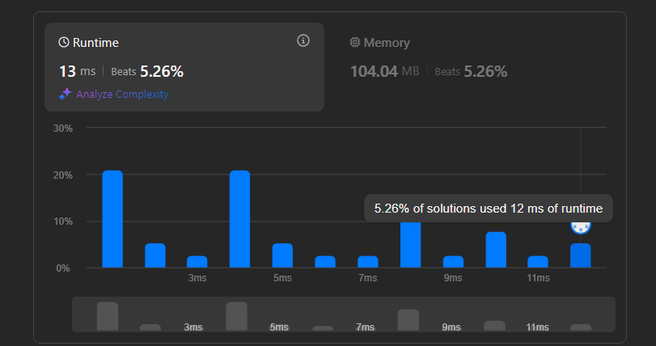

# Partition Array according to given Pivot

- Wir allokieren 3 Arrays und speichern dort dann einfach die kleineren, gleichen und größeren Zahlen drin.

- Wir populieren dann die Arrays mit den dementsprechenden Zahlen und führen dann die einzelnen Arrays (zuerst kleinere, gleich, größere) wieder zusammen und haben unseren fertig Array.
  
